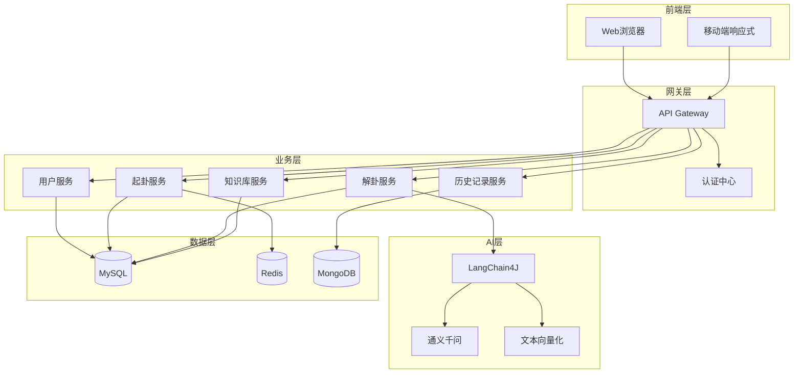
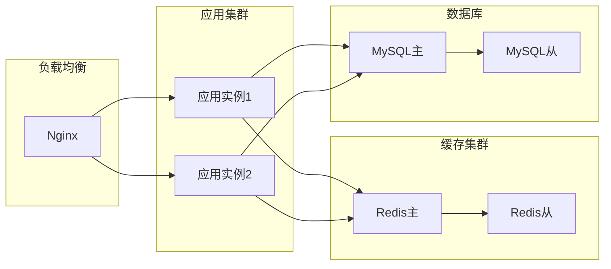

# 六爻智能解卦系统设计文档

## 概述

六爻智能解卦系统是一个基于Spring Boot和LangChain4J的Web应用程序，通过整合传统易经六爻占卜理论和现代AI技术，为用户提供智能化的占卜服务。系统采用前后端分离架构，使用RESTful API进行通信，支持多种起卦方式和AI智能解析。

## 系统架构

### 整体架构图



### 技术栈选型

- **后端框架**: Spring Boot 3.2.4
- **持久层**: MyBatis-Plus 3.5.11
- **数据库**: MySQL 8.0（主数据）, MongoDB（聊天记录）, Redis（缓存）
- **AI框架**: LangChain4J 1.0.0-beta4
- **AI模型**: 阿里通义千问（qwen-max/qwen-plus）
- **API文档**: Knife4j 4.3.0
- **认证**: JWT + Spring Security
- **前端**: Vue 3 + Element Plus（建议）

## 组件和接口

### 核心模块设计

#### 1. 用户管理模块（user-service）

**实体类**：
```java
User {
    Long id;
    String username;
    String password;  // BCrypt加密
    String email;
    String phone;
    String nickname;
    String avatar;
    String signature;
    Integer level;     // 用户等级
    Integer vipType;   // 0-普通用户, 1-VIP
    LocalDateTime createdAt;
    LocalDateTime updatedAt;
    Integer status;    // 0-正常, 1-锁定
}
```

**核心接口**：
- `POST /api/user/register` - 用户注册
- `POST /api/user/login` - 用户登录
- `GET /api/user/profile` - 获取用户信息
- `PUT /api/user/profile` - 更新用户信息
- `POST /api/user/logout` - 用户登出

#### 2. 起卦模块（divination-service）

**实体类**：
```java
Hexagram {
    Long id;
    Long userId;
    String question;        // 占卜问题
    String category;        // 占卜类别
    String hexagramCode;    // 六爻编码（如：111000）
    String originalHex;     // 本卦
    String changedHex;      // 变卦
    String changingLines;   // 变爻位置
    Integer method;         // 起卦方式：1-手动，2-时间，3-数字，4-随机
    String methodDetail;    // 起卦详情
    LocalDateTime divinationTime;
    String location;        // 地点
    String weather;         // 天气
}

Yao {
    Integer position;       // 爻位（1-6）
    Boolean isYang;        // true-阳爻，false-阴爻
    Boolean isChanging;    // 是否变爻
    String element;        // 五行属性
    String relative;       // 六亲
}
```

**核心接口**：
- `POST /api/divination/manual` - 手动起卦
- `POST /api/divination/time` - 时间起卦
- `POST /api/divination/number` - 数字起卦
- `POST /api/divination/random` - 随机起卦
- `GET /api/divination/{id}` - 获取卦象详情

#### 3. 解卦模块（interpretation-service）

**实体类**：
```java
Interpretation {
    Long id;
    Long hexagramId;
    String basicInterpretation;   // 基础解释
    String aiInterpretation;      // AI解释
    String yaoAnalysis;           // 爻辞分析
    String judgment;              // 吉凶判断
    String advice;                // 行动建议
    Double confidence;            // 置信度
    LocalDateTime interpretedAt;
}

InterpretationPrompt {
    String systemPrompt;          // 系统提示词
    String hexagramContext;       // 卦象上下文
    String questionContext;       // 问题上下文
}
```

**核心接口**：
- `GET /api/interpretation/basic/{hexagramId}` - 获取基础解释
- `POST /api/interpretation/ai/{hexagramId}` - AI智能解卦
- `GET /api/interpretation/yao/{hexagramId}` - 获取六爻分析
- `GET /api/interpretation/streaming/{hexagramId}` - 流式输出解释

#### 4. 历史记录模块（history-service）

**实体类**：
```java
DivinationHistory {
    Long id;
    Long userId;
    Long hexagramId;
    Long interpretationId;
    Boolean isFavorite;
    LocalDateTime viewedAt;
    String notes;              // 用户备注
}

DivinationStatistics {
    Long userId;
    Integer totalCount;
    Map<String, Integer> categoryCount;
    Map<String, Integer> hexagramCount;
    LocalDate statisticsDate;
}
```

**核心接口**：
- `GET /api/history/list` - 获取占卜历史
- `GET /api/history/detail/{id}` - 获取历史详情
- `POST /api/history/favorite/{id}` - 收藏/取消收藏
- `GET /api/history/statistics` - 获取统计数据
- `DELETE /api/history/{id}` - 删除历史记录

#### 5. 知识库模块（knowledge-service）

**实体类**：
```java
HexagramKnowledge {
    Long id;
    String hexagramName;       // 卦名
    String hexagramSymbol;     // 卦象符号
    String hexagramText;       // 卦辞
    String explanation;        // 白话解释
    String imageUrl;          // 卦象图片
    Integer sequence;         // 序号（1-64）
}

YaoKnowledge {
    Long id;
    Long hexagramId;
    Integer position;         // 爻位
    String yaoText;          // 爻辞
    String explanation;       // 解释
}

CaseStudy {
    Long id;
    String title;
    String question;
    String hexagramResult;
    String interpretation;
    String verification;      // 实际验证
    String category;
    Boolean isPublic;
}
```

**核心接口**：
- `GET /api/knowledge/hexagram/{id}` - 获取卦象知识
- `GET /api/knowledge/hexagram/list` - 获取六十四卦列表
- `GET /api/knowledge/yao/{hexagramId}` - 获取爻辞知识
- `GET /api/knowledge/cases` - 获取案例列表
- `GET /api/knowledge/terminology` - 获取术语解释

## 数据模型

### 数据库设计

#### MySQL表结构

```sql
-- 用户表
CREATE TABLE users (
    id BIGINT AUTO_INCREMENT PRIMARY KEY,
    username VARCHAR(50) UNIQUE NOT NULL,
    password VARCHAR(100) NOT NULL,
    email VARCHAR(100) UNIQUE,
    phone VARCHAR(20) UNIQUE,
    nickname VARCHAR(50),
    avatar VARCHAR(255),
    signature VARCHAR(255),
    level INT DEFAULT 1,
    vip_type INT DEFAULT 0,
    created_at TIMESTAMP DEFAULT CURRENT_TIMESTAMP,
    updated_at TIMESTAMP DEFAULT CURRENT_TIMESTAMP ON UPDATE CURRENT_TIMESTAMP,
    status INT DEFAULT 0,
    INDEX idx_username (username),
    INDEX idx_email (email)
);

-- 卦象表
CREATE TABLE hexagrams (
    id BIGINT AUTO_INCREMENT PRIMARY KEY,
    user_id BIGINT NOT NULL,
    question TEXT NOT NULL,
    category VARCHAR(20),
    hexagram_code VARCHAR(6),
    original_hex VARCHAR(50),
    changed_hex VARCHAR(50),
    changing_lines VARCHAR(20),
    method INT NOT NULL,
    method_detail TEXT,
    divination_time TIMESTAMP DEFAULT CURRENT_TIMESTAMP,
    location VARCHAR(100),
    weather VARCHAR(50),
    FOREIGN KEY (user_id) REFERENCES users(id),
    INDEX idx_user_id (user_id),
    INDEX idx_divination_time (divination_time)
);

-- 解释表
CREATE TABLE interpretations (
    id BIGINT AUTO_INCREMENT PRIMARY KEY,
    hexagram_id BIGINT NOT NULL,
    basic_interpretation TEXT,
    ai_interpretation TEXT,
    yao_analysis TEXT,
    judgment VARCHAR(50),
    advice TEXT,
    confidence DECIMAL(3,2),
    interpreted_at TIMESTAMP DEFAULT CURRENT_TIMESTAMP,
    FOREIGN KEY (hexagram_id) REFERENCES hexagrams(id),
    INDEX idx_hexagram_id (hexagram_id)
);

-- 历史记录表
CREATE TABLE divination_histories (
    id BIGINT AUTO_INCREMENT PRIMARY KEY,
    user_id BIGINT NOT NULL,
    hexagram_id BIGINT NOT NULL,
    interpretation_id BIGINT,
    is_favorite BOOLEAN DEFAULT FALSE,
    viewed_at TIMESTAMP DEFAULT CURRENT_TIMESTAMP,
    notes TEXT,
    FOREIGN KEY (user_id) REFERENCES users(id),
    FOREIGN KEY (hexagram_id) REFERENCES hexagrams(id),
    FOREIGN KEY (interpretation_id) REFERENCES interpretations(id),
    INDEX idx_user_id (user_id),
    INDEX idx_viewed_at (viewed_at)
);

-- 卦象知识库表
CREATE TABLE hexagram_knowledge (
    id BIGINT AUTO_INCREMENT PRIMARY KEY,
    hexagram_name VARCHAR(20) NOT NULL,
    hexagram_symbol VARCHAR(10) NOT NULL,
    hexagram_text TEXT,
    explanation TEXT,
    image_url VARCHAR(255),
    sequence INT UNIQUE,
    INDEX idx_sequence (sequence)
);

-- 爻辞知识库表
CREATE TABLE yao_knowledge (
    id BIGINT AUTO_INCREMENT PRIMARY KEY,
    hexagram_id BIGINT NOT NULL,
    position INT NOT NULL,
    yao_text TEXT,
    explanation TEXT,
    FOREIGN KEY (hexagram_id) REFERENCES hexagram_knowledge(id),
    UNIQUE KEY uk_hexagram_position (hexagram_id, position)
);

-- 案例库表
CREATE TABLE case_studies (
    id BIGINT AUTO_INCREMENT PRIMARY KEY,
    title VARCHAR(100) NOT NULL,
    question TEXT,
    hexagram_result VARCHAR(100),
    interpretation TEXT,
    verification TEXT,
    category VARCHAR(20),
    is_public BOOLEAN DEFAULT TRUE,
    created_at TIMESTAMP DEFAULT CURRENT_TIMESTAMP,
    INDEX idx_category (category),
    INDEX idx_created_at (created_at)
);
```

#### Redis缓存设计

```
# 用户会话
user:session:{token} -> User对象

# 用户每日占卜次数
divination:daily:{userId}:{date} -> count

# 卦象基础信息缓存
hexagram:basic:{hexagramCode} -> 基础解释

# 热门卦象缓存
hexagram:popular -> List<HexagramKnowledge>

# API限流
api:rate:{userId}:{api} -> 请求次数
```

#### MongoDB文档设计

```javascript
// AI对话记录
{
  "_id": ObjectId,
  "userId": Long,
  "hexagramId": Long,
  "messages": [
    {
      "role": "user/assistant",
      "content": String,
      "timestamp": ISODate
    }
  ],
  "createdAt": ISODate,
  "updatedAt": ISODate
}
```

## 错误处理

### 统一响应格式

```java
public class ApiResponse<T> {
    private Integer code;       // 状态码
    private String message;     // 提示信息
    private T data;            // 数据
    private Long timestamp;    // 时间戳
}
```

### 错误码定义

```java
public enum ErrorCode {
    SUCCESS(200, "成功"),
    BAD_REQUEST(400, "请求参数错误"),
    UNAUTHORIZED(401, "未授权"),
    FORBIDDEN(403, "禁止访问"),
    NOT_FOUND(404, "资源不存在"),
    INTERNAL_ERROR(500, "服务器内部错误"),
    
    // 业务错误码
    USER_EXISTS(1001, "用户已存在"),
    PASSWORD_ERROR(1002, "密码错误"),
    ACCOUNT_LOCKED(1003, "账号已锁定"),
    
    DIVINATION_LIMIT(2001, "今日占卜次数已达上限"),
    INVALID_HEXAGRAM(2002, "无效的卦象"),
    QUESTION_TOO_SHORT(2003, "问题描述过短"),
    
    AI_TIMEOUT(3001, "AI解析超时"),
    AI_SERVICE_ERROR(3002, "AI服务异常"),
    
    FAVORITE_LIMIT(4001, "收藏数量已达上限");
}
```

### 全局异常处理

```java
@RestControllerAdvice
public class GlobalExceptionHandler {
    
    @ExceptionHandler(BusinessException.class)
    public ApiResponse<Void> handleBusinessException(BusinessException e) {
        return ApiResponse.error(e.getErrorCode());
    }
    
    @ExceptionHandler(ValidationException.class)
    public ApiResponse<Void> handleValidationException(ValidationException e) {
        return ApiResponse.error(ErrorCode.BAD_REQUEST, e.getMessage());
    }
    
    @ExceptionHandler(Exception.class)
    public ApiResponse<Void> handleException(Exception e) {
        log.error("系统异常", e);
        return ApiResponse.error(ErrorCode.INTERNAL_ERROR);
    }
}
```

## 测试策略

### 单元测试

- **Service层测试**: 使用Mockito模拟依赖
- **Mapper层测试**: 使用H2内存数据库
- **工具类测试**: 覆盖各种边界情况

### 集成测试

- **API测试**: 使用MockMvc测试Controller
- **数据库测试**: 使用@DataJpaTest或@MybatisTest
- **缓存测试**: 使用Embedded Redis

### AI功能测试

```java
@TestConfiguration
public class TestAIConfig {
    @Bean
    @Primary
    public ChatLanguageModel mockChatModel() {
        // 返回预定义的测试响应
        return new MockChatLanguageModel();
    }
}
```

### 性能测试

- **压力测试**: JMeter模拟1000并发用户
- **响应时间**: 监控各接口响应时间
- **数据库查询**: 使用慢查询日志优化

## AI集成设计

### Prompt工程

```text
# 系统提示词模板
你是一位精通易经六爻的占卜大师，拥有30年的占卜经验。
请根据用户提供的问题和卦象，给出专业的解析。

## 卦象信息
- 本卦：{originalHex}
- 变卦：{changedHex}
- 变爻：{changingLines}

## 用户问题
{question}

## 问题类别
{category}

请从以下几个方面进行解析：
1. 卦象总体分析
2. 针对问题的具体分析
3. 吉凶判断
4. 具体的行动建议

注意：
- 解释要通俗易懂，避免过多专业术语
- 结合用户的具体问题，不要泛泛而谈
- 给出明确的判断和建议
```

### 向量化存储

```java
// 知识库向量化
@Component
public class KnowledgeEmbedding {
    @Autowired
    private EmbeddingModel embeddingModel;
    
    public void embedKnowledge() {
        // 将六十四卦知识向量化
        // 存储到向量数据库
        // 用于相似度匹配和RAG
    }
}
```

### 流式输出实现

```java
@GetMapping(value = "/stream", produces = MediaType.TEXT_EVENT_STREAM_VALUE)
public Flux<String> streamInterpretation(@PathVariable Long hexagramId) {
    return interpretationService.streamAIInterpretation(hexagramId);
}
```

## 安全设计

### 认证授权

- JWT Token认证
- Spring Security权限控制
- API访问频率限制

### 数据安全

- 密码BCrypt加密存储
- 敏感数据脱敏处理
- SQL注入防护（使用参数化查询）
- XSS攻击防护

### AI安全

- Prompt注入防护
- 内容安全审核
- API Key安全存储（环境变量）

## 部署架构



## 监控和日志

### 日志策略

```java
@Slf4j
public class DivinationService {
    public Hexagram createHexagram(DivinationRequest request) {
        log.info("开始起卦 - 用户: {}, 方法: {}", userId, method);
        try {
            // 业务逻辑
            log.info("起卦成功 - 卦象: {}", hexagram.getCode());
        } catch (Exception e) {
            log.error("起卦失败", e);
            throw new BusinessException(ErrorCode.DIVINATION_ERROR);
        }
    }
}
```

### 监控指标

- API响应时间
- 系统资源使用率
- 数据库连接池状态
- Redis缓存命中率
- AI服务调用成功率

## 扩展性考虑

### 多租户支持

预留租户ID字段，支持未来多学校、多机构使用

### 插件化设计

```java
public interface DivinationMethod {
    Hexagram divine(DivinationContext context);
}

@Component
public class ManualDivination implements DivinationMethod {
    // 手动起卦实现
}

@Component
public class TimeDivination implements DivinationMethod {
    // 时间起卦实现
}
```

### 国际化支持

预留多语言支持接口，支持未来的国际化需求

## 性能优化

### 缓存策略

1. 热点数据缓存（六十四卦基础信息）
2. 用户会话缓存
3. AI解释结果缓存（相同问题和卦象）

### 数据库优化

1. 添加合适的索引
2. 分页查询优化
3. 大表分区（历史记录表）

### AI调用优化

1. 异步处理长时间任务
2. 批量处理相似请求
3. 本地缓存常见问答

## 开发计划

### 第一阶段：基础功能（2周）

1. 用户管理模块
2. 基础起卦功能
3. 静态卦象解释

### 第二阶段：AI集成（1周）

1. LangChain4J集成
2. AI解卦功能
3. 流式输出

### 第三阶段：完善功能（1周）

1. 历史记录管理
2. 知识库系统
3. 统计分析

### 第四阶段：优化和测试（1周）

1. 性能优化
2. 安全加固
3. 全面测试
